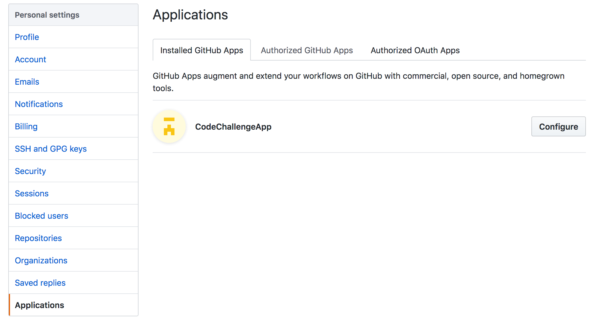
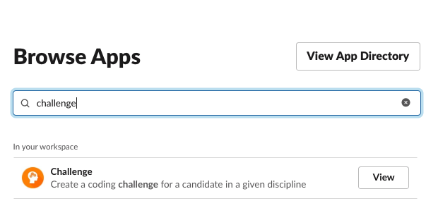
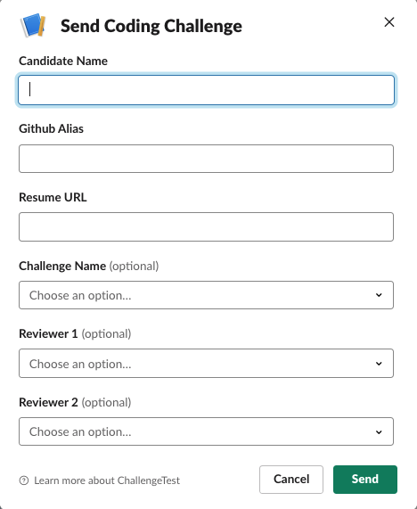
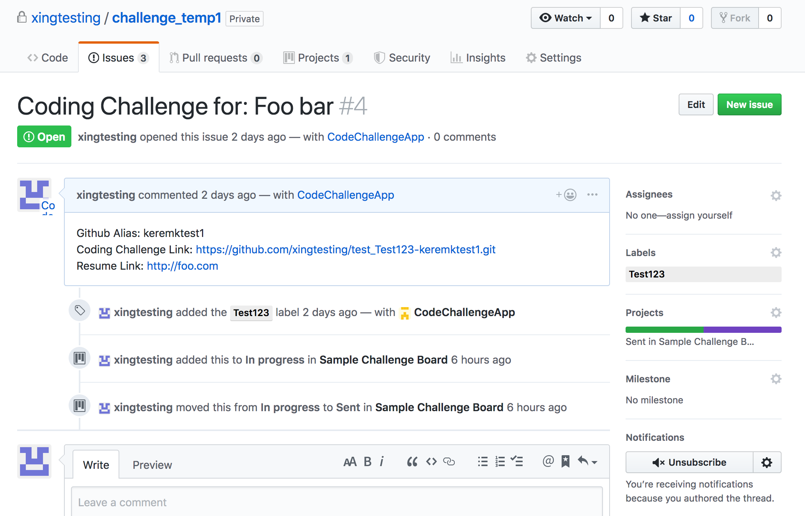

# Coding Challenge App

You can use this app to manage coding challenges that you send to candidates. It is both a Slack App and a Github App. It integrates into Slack to allow anyone to register a new coding challenge and send a coding challenge to a candidate using a Slash command - `/challenge`. It integrates into your Github repository, so that you can create a new private repository per candidate from a coding challenge template repository. For each coding challenge sent, it also creates a Github issue in the coding challenge template repository to track the active challenges.

Below you will find sections on:

* How to use on a daily basis 
* How to set it up for your own Slack environment and Github accounts (organization or self owned)
* How to contribute to it

## Quick Start
If everything is already setup for you (as described in following stages), and all you want to do is to send a coding challenge to someone, then just jump to this [section](#Send-a-coding-challenge).

## Usage
This section assumes that you have setup this application either [yourself](#Self-Host-Setup) or somebody else did it for you and you want to use it in your Slack workgroup. (Note that this app is currently not available for use publicly, it is still in development, but you can try self hosting it.)

### Register the Challenge Github App in your Github Account
You will either get a link to install this app (because somebody else is doing the hosting and sent you the link), or you are self hosting this app as your own private app. Either case you need to register this app to your Github account to be able to start using it.

Once you install it (by clicking on the link on the provided URL), the app should be seen as below in your Github account:



The app installation will take you to a next step, where you need to also authorize the application as a user - please also accept the authorization and once you do, it should show like below:


### Register the Challenge App in Slack
You also need to register the app in your Slack workspace to start using the / commands from Slack.

Below is how you can add the app to your workspace:



### Create a new challenge template in Github
In order to start the process, you need to first create a repo that contains your challenge template in the Github account you registered the app with - [see previous section](#Register-the-Challenge-Github-App-in-your-Github-Account). In the repo you can include anything you want as a starter for the challenge. This repo will then be replicated for the candidate as a starter one. Also you would want to make this repo a private one.

Below is an example template:


### Register the challenge template
Before sending a new challenge, you need to register the challenge template into the database. To do that you will need to type in the below: (We recommend you to create a specific Slack channel for all the coding challenges you will be sending. If there are multiple challenges for different positions, it is better to create different channels for each in Slack)

* Go to your Slack channel and type:

```
  /challenge new
```

* You will be presented by the below dialog:


* In the above dialog:
  * *Challenge Name* Give a user friendly and unique name to the challenge, you will be using this later to pick a template for the challenge.
  * *Template Repo Name* The name of the Github Challenge Template Repo that you have registered before. E.g. challenge_temp1 from the [previous screenshot](Create-a-new-challenge-template-in-Github)
  * *Repo Name Format* You can specify a naming format for repos that the tool will be creating for the candidates. The default is already populated so you can either keep it or modify it. Use `CHALLENGENAME` as a placeholder for the name of the challenge and `GITHUBALIAS` as a placeholder for the candidate's github alias.
  * *Github Account Name* Specify the Github account the challenge repos (and their templates) will be (are) stored.  
* And once you are comfortable tap `Create` button. This will register the coding challenge template.

### Register a reviewer
You can register reviewers to review coding challenges. In order to do that:

* Go to your Slack channel and type:

```
  /reviewer new
```

* You will be presented by the below dialog:


* In the above dialog:
  * *Reviewer* From the drop-down select the name of the reviewer you like to register
  * *Github Alias* Type in the github alias for the reviewer
  * *Challenge Name* Select from the drop-down the challenge name the reviewer will be able to review.
  * *Technology List* Add a comma delimited list of languages/technologies which the reviewer can evaluate. E.g. ruby,elixir 

### Send a coding challenge
In order to send a coding challenge, you can type in the below: (We recommend you to create a specific Slack channel for all the coding challenges you will be sending. If there are multiple challenges for different positions, it is better to create different channels for each in Slack)

* Go to your Slack channel and type:

```
  /challenge send (optional ChallengeName)
```

* You will be presented by the below dialog:



* In the above dialog:
  * *Candidate Name* Type in the full name of the candidate so that you can identify them later.
  * *Github Alias* Enter the github alias for the candidate. If this is not a valid alias, the challenge will not be created. This needs to be the github alias (name) and -not- their email address.
  * *Resume URL* Type in the URL for the resume of the candidate. These can be links to your internal Application Tracking system or XING/LinkedIn/Github account urls. 
  * *Challenge Name* From the dropdown, pick the name of the challenge (which you have registered in the prior steps).
  * *Reviewer 1* From the dropdown, pick the name of the reviewer to review the coding challenge. The reviewers need to be registered with the system to appear in this dropdown. If you optionally specified the name of challenge, the list of reviewers will be filtered for the challange.
  * *Reviewer 2* You can add a second reviewer using this dropdown.
* And once you are comfortable tap `Create` button. This will create a new coding challenge repository, add the candidate as a collaborator (at which point Github will send an invite email) and finally create an issue for you to track the coding challenge.

You will see a summary like below:


An issue will be created automatically in the challenge template repository in Github so you track this:



You can optionally create a project in Github such as below to track the lifecycle:


## Self Host Setup


## Contribute

